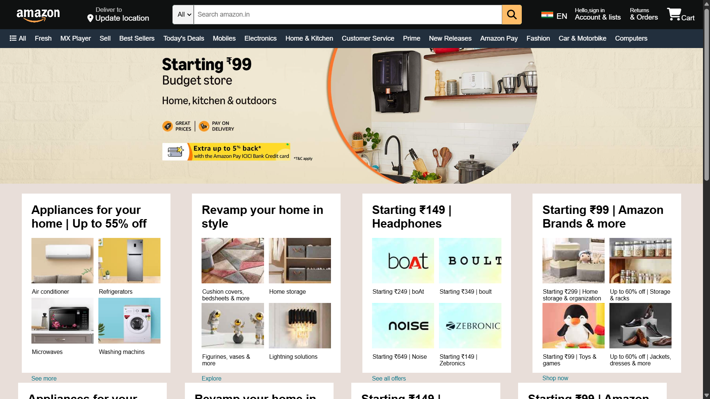
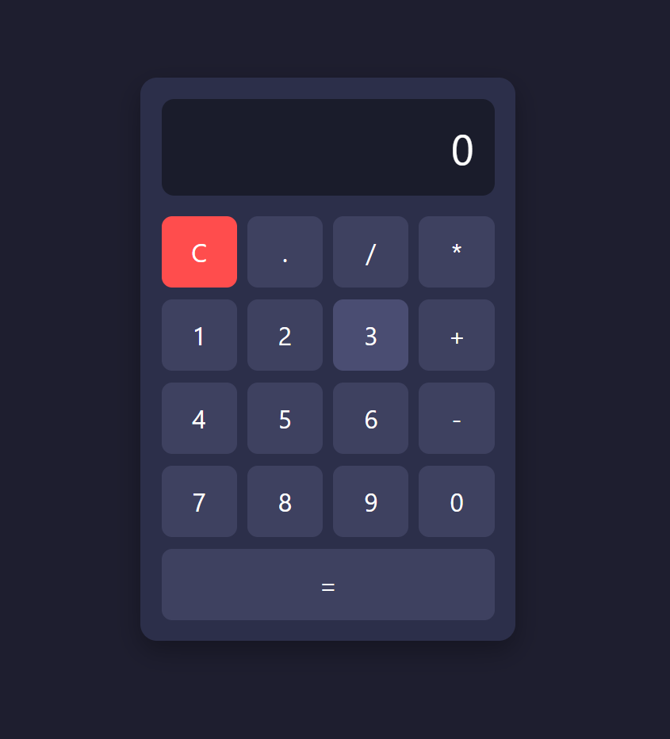
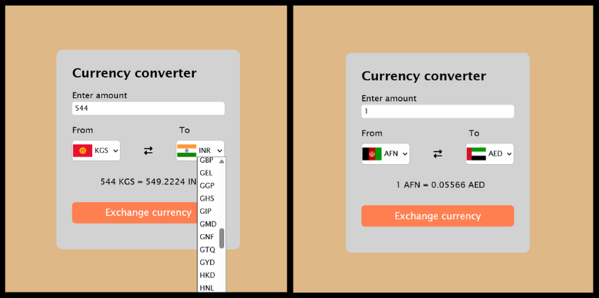
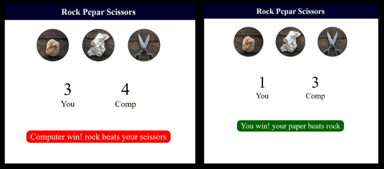
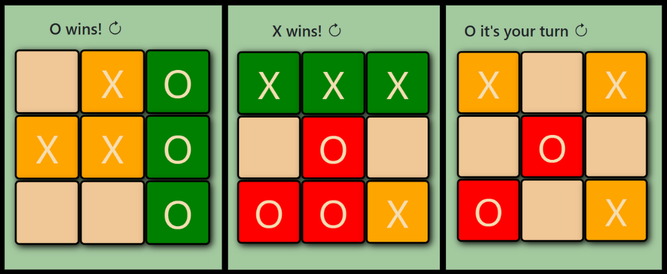
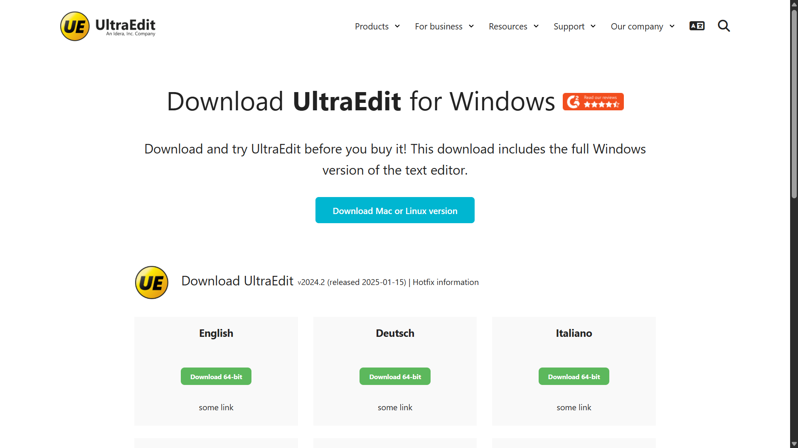

# 🎨 Frontend Mini Projects Collection

A collection of small but creative frontend projects built using **HTML, CSS, and JavaScript**.  
Each project focuses on improving UI design, logic building, and core web development skills.

---

## 🧩 Projects Included

### 1️⃣ Amazon Clone (UI Only)

A static clone of Amazon’s homepage — built purely with HTML & CSS to practice layout structure and design consistency.

📸 **Screenshot:**   
🧱 **Tech:** HTML, CSS

---

### 2️⃣ Calculator with Functional Logic

A fully functional calculator performing basic arithmetic operations with a clean UI.

📸 **Screenshot:** 
🧱 **Tech:** HTML, CSS, JavaScript

---

### 3️⃣ Currency Converter

A simple currency converter app using **real-time exchange rates** fetched from a **Currency API** (like ExchangeRate API / Open Exchange Rates).  
Demonstrates API fetching, dynamic DOM updates, and basic input validation.

📸 **Screenshot:** 
🧱 **Tech:** HTML, CSS, JavaScript, Currency API

---

### 4️⃣ Rock Paper Scissors Game

A fun interactive game built using JavaScript, allowing users to play against the computer.

📸 **Screenshot:** 
🧱 **Tech:** HTML, CSS, JavaScript

---

### 5️⃣ Tic Tac Toe Game

Classic Tic Tac Toe game with two-player logic and simple UI animations.

📸 **Screenshot:** 
🧱 **Tech:** HTML, CSS, JavaScript

---

### 6️⃣ UltraEdit Clone (UI Only)

A simple UI clone of UltraEdit’s landing page, created to practice design replication.

📸 **Screenshot:** 
🧱 **Tech:** HTML, CSS

---

## 💡 Key Learning Outcomes

- Strengthened understanding of **HTML structure** and **CSS layout**
- Improved **DOM manipulation** and **JS event handling**
- Practiced building **interactive UI components** without frameworks
- Enhanced **attention to design detail** by cloning real-world UIs

---

## 📱 Note

> Currently non-responsive — planned for future mobile optimization.

---

## 👨‍💻 Author

**Deep Debnath** — Frontend Developer  
📍 Habra, West Bengal, India  
📧 [deepdebnath7432@gmail.com](mailto:deepdebnath7432@gmail.com)  
🌐 [GitHub Profile](https://github.com/Deep-Debnath)

---

⭐ **If you like this repo, don’t forget to star it!**  
It motivates me to build more creative frontend projects 🚀
